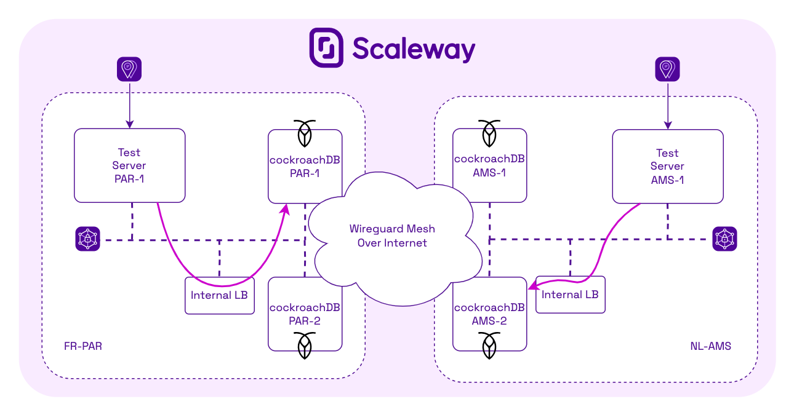

Multi-region CockroachDB cluster @ Scaleway
===========================================

The goal of this PoC is to demonstrate using CockroachDB as PostgreSQL compatible Multi-Region active/active cluster to have High Availability accross regions.

Using the `terraform` folder, you can setup the following infrastructure:

Then you can update the `inventory` file and leverage Ansible to install the cluster.

Usage
-----

Install Ansible, Terraform and optionally GNU/make.

Run with `make` or check `Makefile` for commands

NB
--

- The Terraform manifest leverage [yawm](https://github.com/n-Arno/yawm) to generate the Wireguard Mesh. Any other tool can be used to do so.
- The DB console is available via the instances PN IP on port 8080.
- The SQL access is done either via PN IP on port 5432 or via the internal LB created.
- The RPC access between node is only listening on the wireguard interface using the default port.
